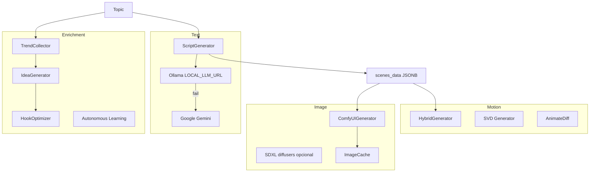

# AI Architecture

Arquitectura de inteligencia artificial y generación de contenido del proyecto Auto Video Maker.

---

## Visión general



---

## LLMs utilizados

### Ollama (primario)

| Parámetro | Valor código |
|-----------|--------------|
| URL | `LOCAL_LLM_URL` default `http://192.168.1.41:11434` |
| Modelo | `LOCAL_LLM_MODEL` default `llama3.1:8b-instruct-q4_K_M` |
| Cliente | `core/llm_client.py` → `LocalLLMClient` |
| Endpoints | `POST /api/generate`, `POST /api/chat` |
| Timeout HTTP | 600 s |
| Reintentos | 3 con backoff 2×attempt |

`json_mode=True` envía `"format": "json"` en payload Ollama.

### Google Gemini (fallback guion)

| Parámetro | Valor |
|-----------|-------|
| SDK | `google-generativeai` |
| Modelo | `GEMINI_MODEL` default `gemini-2.0-flash` |
| API key | `GEMINI_API_KEY` o por usuario en `UserSettings.gemini_api_key` |
| Función | `core/gemini_client.generate_gemini_prompt` |

Orden en `ScriptGenerator.generate`:

1. Ollama (hasta 600 s)
2. Si falla → Gemini
3. Si falla → `_generate_fallback_script` (3 escenas estáticas)

---

## Generación de guiones

### Prompt template (`ScriptGenerator._build_system_prompt`)

Instrucciones incluyen:

- Plataforma (TikTok / YouTube / Instagram) con reglas de estilo
- Tono, audiencia, idioma
- Estructura desde `template.structure_json`
- Formato JSON estricto: lista de objetos `{ text, duration, image_prompt }`
- `image_prompt` en inglés, descriptivo para SD

### Parsing robusto

- Regex `\[[\s\S]*\]` para extraer array JSON
- Función recursiva `extract_scenes` para anidar dicts tipo `{"Escena 1": {...}}`
- Validación Pydantic `AIScene`

### Inyección Viral / Autonomous Learning (`scripting_task`)

Cuando no falla el bloque try, el topic se sustituye por texto enriquecido:

1. `TrendCollector.collect_synthetic_trends()`
2. `TrendRanker.get_top(..., 5)`
3. `TrendSaturationDetector` filtra saturados
4. `IdeaGenerator.generate`
5. `HookOptimizer.optimize`
6. `PerformanceFeedbackEngine.analyze_history`
7. `ABTestingEngine.generate_variants` → hook A
8. `StyleRecommender.recommend`
9. `ViralMemorySystem.persist_*`
10. `LightweightVectorMemory.add_idea`

---

## Planificación de escenas

### Estructura en DB

Cada elemento de `scenes_data`:

```json
{
  "text": "voiceover",
  "duration": 8,
  "image_prompt": "Cinematic shot...",
  "image_path": "generated_images/abc.png",
  "audio_path": "generated_audio/...",
  "duration": 12.4,
  "status": "AUDIO_GENERATED",
  "character": "narrator",
  "emotion": "neutral",
  "camera_motion": "dynamic"
}
```

### SceneTimelineEngine

| Método | Función |
|--------|---------|
| `build_canonical_scene` | Crea dict estándar PENDING |
| `merge_media_state` | Actualiza audio/image, estados AUDIO_GENERATED / READY |
| `validate_timeline` | Exige READY y duration > 0 |

### Scene optimizer / supervisor

- `story/scene_optimizer.py` — optimización narrativa
- `ai_director/scene_supervisor.py` — validación pre-render en `assemble_video`

---

## Generación de imágenes

### ComfyUI Integration

**Clase:** `ComfyUIGenerator` (`ai/image_generation/comfyui_generator.py`)

#### Invocación

1. `POST {COMFYUI_URL}/free` — liberar memoria
2. `GET /queue` — si hay jobs, `POST /interrupt` + `POST /queue` `{clear:true}`
3. `POST /prompt` con workflow JSON
4. Poll `GET /history/{prompt_id}` cada 2 s hasta `max_wait_seconds`
5. Descarga imagen desde output nodo SaveImage

#### Workflow nodes (IDs fijos)

| Node | class_type | Rol |
|------|------------|-----|
| 3 | KSampler | euler, steps 25, cfg 7, scheduler normal |
| 4 | CheckpointLoaderSimple | `COMFYUI_CHECKPOINT` |
| 5 | EmptyLatentImage | width×height |
| 6 | CLIPTextEncode | prompt positivo |
| 7 | CLIPTextEncode | negativo |
| 8 | VAEDecode | |
| 9 | SaveImage | salida |

#### Parámetros por defecto

| Parámetro | Valor |
|-----------|-------|
| Resolución workflow default | 896×1152 (9:16 aprox) |
| Resolución `image_generator.py` | 1024×1024 |
| Negative prompt | bad quality, blurry, watermark, text |
| Seed | `VIDEO_BASE_SEED` + `TemporalConsistencyEngine.get_seed_for_scene` |
| Timeout escena | `COMFYUI_SCENE_TIMEOUT_SECONDS` default 180 |

#### Checkpoint

Default: `Juggernaut-XL_v9_RunDiffusionPhoto_v2.safetensors` (SDXL family).

#### Caché

`ImageCache` — clave por prompt+style+seed; evita regenerar.

#### Monitorización

- `comfyui_health.py` — `is_comfyui_available()`, `get_comfyui_status()`
- Startup API opcional: lanza `COMFYUI_START_SCRIPT_PATH` vía `wscript` (Windows)

### Stable Diffusion / SDXL (alternativa local)

`generation_config.py`:

| Variable | Default |
|----------|---------|
| SDXL_MODEL | stabilityai/stable-diffusion-xl-base-1.0 |
| SDXL_DEVICE | cuda |
| SDXL_STEPS | 30 |
| SDXL_GUIDANCE_SCALE | 7.5 |
| SDXL_IMAGE_WIDTH/HEIGHT | 1024 |

`sdxl_generator.py` usa diffusers cuando no se usa ComfyUI (`USE_COMFYUI`).

### Prompt enhancement

- `prompt_enhancer.py` — enriquecimiento de prompts
- Consistency hint añadido en `image_generator.py`: `consistent character, lighting, color palette`
- `TemporalConsistencyEngine.get_latent_reuse_params()` — FreeU hint en prompt si aplica

### GPU lock

`tasks/gpu_lock.py` — lock Redis antes de ComfyUI; `GPU_LOCK_WAIT_SECONDS` default 30.

---

## Generación de audio (IA TTS)

Ver [AUDIO_PIPELINE.md](./AUDIO_PIPELINE.md). El guion define el texto; la duración del audio gobierna el clip de vídeo.

---

## Sincronización audiovisual

### Audio-First

1. TTS genera MP3
2. `get_audio_duration` (ffprobe) → `scene["duration"]`
3. FFmpeg `-t duration` en `_create_scene_clip`
4. Mínimo 3 s por escena

### Timeline en composición

`AdaptiveEditor.finalize_timeline` ajusta escenas según `emotional_graph` y plataforma antes de render.

---

## Modelos de vídeo IA (motion)

| Módulo | Uso |
|--------|-----|
| `video_ai/hybrid_generator.py` | Intenta motion AI por escena antes de Ken Burns |
| `video_ai/svd_generator.py` | Stable Video Diffusion |
| `video_ai/animatediff_generator.py` | AnimateDiff |
| `video_generator_future.py` | Kling, Runway, Veo — flags por env API keys |

`GET /api/v1/ai-backends` lista disponibilidad.

---

## Chains y pipelines Celery (texto → vídeo)

No hay LangChain en requirements; el “chain” es código imperativo en `pipeline.py` y `build_dynamic_pipeline` con `.run()` síncrono entre tareas en el mismo worker.

---

## ComfyUI — resumen operativo

| Operación | HTTP |
|-----------|------|
| Encolar | POST `/prompt` |
| Estado | GET `/history/{id}` |
| Cola | GET `/queue` |
| Limpiar | POST `/queue` `{"clear":true}` |
| VRAM | POST `/free` |
| Health | GET `/system_stats` o URL configurada |

---

## Riesgos IA

| Riesgo | Severidad | Mitigación |
|--------|-----------|------------|
| LLM devuelve JSON inválido | Media | Fallback script + regex |
| ComfyUI cola zombie | Alta | Clear queue + interrupt en generator |
| Ollama LAN caído | Media | Gemini + fallback |
| Shim TTS sin audio real | Alta | Integrar SDK ElevenLabs |
