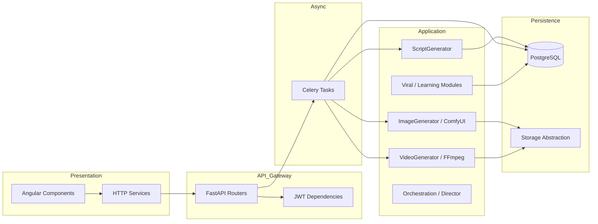
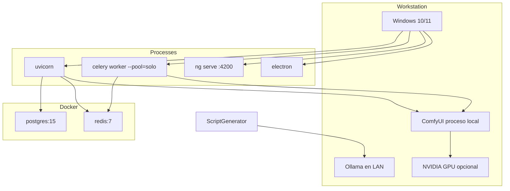
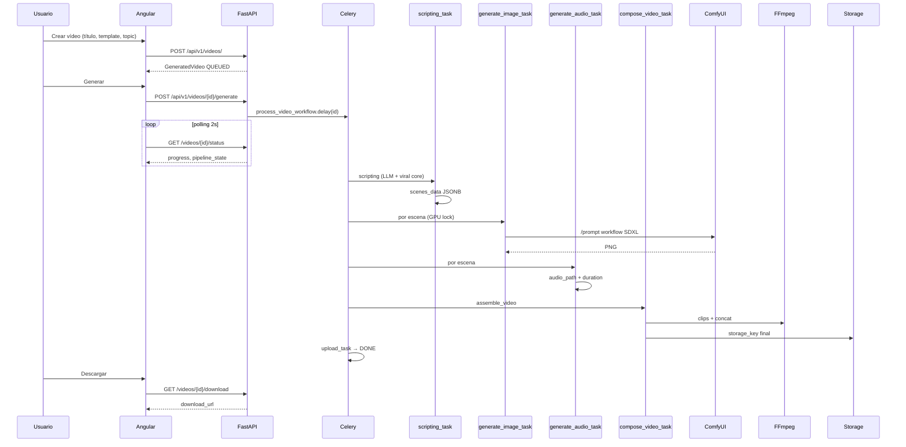

# System Architecture

Documentación de arquitectura basada en el código de `backend/app` y `frontend/auto-video-frontend`.

---

## Arquitectura general

Auto Video Maker implementa un **monolito modular** en Python (FastAPI) con **procesamiento asíncrono** vía Celery, cliente **SPA Angular** empaquetado opcionalmente en **Electron**, y dependencias **externas stateless** (ComfyUI, Ollama, FFmpeg). No hay microservicios desplegados en el repositorio; la “red de canales”, “economía” y “universo narrativo” son **módulos in-process** con APIs parcialmente expuestas.

### Capas

| Capa | Implementación | Responsabilidad |
|------|----------------|-----------------|
| Presentación | Angular 20 + Electron | UX, polling de estado, auth JWT |
| API | FastAPI | REST, CORS, rate limit, static files |
| Aplicación | `services/*` | Lógica de negocio, IA, viral, render |
| Dominio | `models/*` + `schemas/*` | Entidades y contratos |
| Infraestructura | `core/*`, Celery, storage | DB, Redis, config, seguridad |
| Workers | `tasks/*` | Pipeline de vídeo Celery |
| Datos | PostgreSQL + JSONB | Vídeos, escenas, métricas virales |
| Media | `storage` local/S3 + `media/` | Binarios |

---

## Arquitectura lógica

### Pipeline de generación de vídeo (Celery)

`process_video_workflow` → `scripting_task` → `validate_task` → `director_precheck_task` → `build_dynamic_pipeline`:

1. Por cada escena: `generate_image_task` (ComfyUI, cola `gpu_queue`)
2. `images_complete_callback`
3. Por cada escena: `generate_audio_task` (cola `cpu_queue`)
4. `audio_complete_callback`
5. Director stubs: quality + pacing
6. `compose_video_task` → `VideoGenerator.assemble_video`
7. `director_final_analysis_task`
8. `encode_video_task` (placeholder)
9. `upload_task` → status `DONE`

**Invocación:** `process_video_workflow.delay(video_id)` desde la API (`POST /api/v1/videos/{id}/generate`, `/retry`), recuperación al arranque (`video_recovery.py`), scripts (`enqueue.py`, `run_pipeline_eager.py`) y tests.

---

## Arquitectura física (desarrollo típico Windows)

`docker-compose.yml` **solo** levanta PostgreSQL y Redis. Backend, frontend, ComfyUI y Ollama corren en el host.

---

## Arquitectura de despliegue

| Componente | Desarrollo | Producción (inferida del código) |
|------------|------------|----------------------------------|
| API | `uvicorn app.main:app` | Múltiples workers Uvicorn/Gunicorn detrás de reverse proxy |
| Workers | 1 worker `--pool=solo` Windows; Linux puede usar prefork | Workers separados: `cpu_queue`, `gpu_queue`, `upload_queue` |
| DB | Docker Postgres | Postgres gestionado |
| Redis | Docker Redis | Redis HA / ElastiCache |
| Media | `backend/media/` local | `STORAGE_TYPE=s3` + CDN |
| ComfyUI | Auto-start VBS Windows | Servicio GPU dedicado |
| Secrets | `backend/.env` | Variables de entorno del orquestador |

No hay Dockerfile de aplicación en la raíz auditada; despliegue de app es manual/scripts.

---

## Componentes identificados

### Frontend

- **Angular** (`frontend/auto-video-frontend`): rutas lazy-loaded para vídeos, canales, plantillas, settings.
- **Electron** (`main.js`): ventana que carga la URL del dev server o build.

### Backend

- **FastAPI** `app.main:app`
- **APScheduler** (`core/scheduler.py`): iniciado en startup (tareas periódicas del sistema).
- **Celery** `auto_video_maker` con 3 colas.

### Workers y colas

Ver sección [Task Processing Architecture](#task-processing-architecture).

### Bases de datos

- **PostgreSQL** con tablas SQLModel; campos JSONB para `scenes_data`, `scene_progress`, configs de plantilla y datos virales.

### Storage

- **Local** (`services/storage/local.py`): rutas bajo workspace backend.
- **S3** (`services/storage/s3.py`): boto3, variables `S3_*`, `AWS_*`.

### IA

| Función | Provider en código |
|---------|-------------------|
| Guion | Ollama `LOCAL_LLM_URL` → fallback Gemini |
| Mejora título/topic | Ollama `enhance-text` |
| Imagen | ComfyUI HTTP API |
| Imagen alt. | SDXL diffusers (`sdxl_generator.py`, `generation_config.py`) |
| Audio | ElevenLabs shim (`elevenlabs_tts.py`) |
| Motion clip | `HybridGenerator`, SVD, AnimateDiff (opcional si modelos disponibles) |
| Vídeo futuro | Kling, Runway, Veo (`video_generator_future.py`) |

### Proveedores externos

- Google Gemini (`google-generativeai`)
- ElevenLabs (previsto, no SDK completo en repo)
- YouTube OAuth (`youtube_service.py`)
- ComfyUI (self-hosted)

---

## End-to-End Workflow

### Flujo UI → vídeo

### Transformaciones por escena (Celery)

| Paso | Entrada | Salida | Módulo |
|------|---------|--------|--------|
| Scripting | `topic`, `template`, viral enrichment | `scenes_data[]` con `text`, `duration`, `image_prompt` | `scripting.py`, `ScriptGenerator` |
| Validate | escenas | validación / estado VALIDATED | `scripting.validate_task` |
| Imagen | `image_prompt` | `image_path` en storage | `image_generator.py`, ComfyUI |
| Audio | `text` | `audio_path`, `duration` real | `audio_generation.py`, `media_utils` |
| Clip | imagen + audio | `scene_N.mp4` Ken Burns | `video_generator._create_scene_clip` |
| Ensamble | clips[] | `videos/video_*.mp4` | `assemble_video` |

### Audio-First / Timeline

`SceneTimelineEngine` define la estructura canónica y fusiona estado de media:

- `duration` se establece tras generar audio (`get_audio_duration` en `media_utils` / ffprobe en `VideoGenerator`).
- La validación exige `status == READY` y `duration > 0` antes de render.
- En `_create_scene_clip`, la duración del clip FFmpeg es `max(ffprobe(audio), 3.0)` segundos.

---

## Technology Stack

### Backend

| Nombre | Versión | Uso | Justificación |
|--------|---------|-----|---------------|
| Python | 3.10+ (doc dev) | Runtime | Ecosistema ML/FFmpeg |
| FastAPI | 0.121.2 | API REST | Async, OpenAPI, tipado |
| Uvicorn | 0.38.0 | ASGI server | Dev reload |
| SQLModel | 0.0.27 | ORM | Pydantic + SQLAlchemy 2 |
| PostgreSQL | 15-alpine | Persistencia | JSONB, relaciones |
| Celery | 5.3.6 | Tareas largas | Colas GPU/CPU/upload |
| Redis | 5.0.1 / 7-alpine | Broker, lock, heartbeat | Baja latencia |
| httpx | 0.25.2 | ComfyUI, Ollama | Cliente async |
| google-generativeai | 0.8.5 | Fallback guion | Cloud API |
| Pillow | 12.0.0 | Overlays texto | Pre-FFmpeg |
| diffusers/torch | sin pin | SDXL alternativo | Local GPU sin ComfyUI |
| APScheduler | 3.10.4 | Jobs API | Startup scheduler |
| Alembic | 1.13.1 | Migraciones | Evolución schema |
| cryptography | 41.0.7 | Tokens OAuth cifrados | `core/encryption.py` |
| boto3 | — | S3 | Storage cloud |
| pytest | 7.4.3 | Tests | CI local |

**Dependencia usada pero ausente de `requirements.txt`:** `slowapi` (rate limiting en `main.py`). Instalar explícitamente en entornos limpios.

### Frontend

| Nombre | Versión | Uso |
|--------|---------|-----|
| Angular | 20.3.x | SPA |
| TypeScript | 5.9.x | Lenguaje |
| RxJS | 7.8.x | Streams HTTP |
| Tailwind CSS | 3.4.x | Estilos |
| Electron | 39.2.x | Desktop shell |
| Express | 5.1.x | SSR server (Angular SSR) |

### Multimedia / IA

| Nombre | Uso en proyecto |
|--------|-----------------|
| FFmpeg | zoompan, overlay, concat, vidstab, H.264/AAC |
| ComfyUI | KSampler euler, checkpoint Juggernaut XL |
| Ollama | `/api/generate`, `/api/chat` |
| Stable Diffusion XL | vía ComfyUI o `sdxl_generator` |
| Whisper | No referenciado en pipeline principal auditado |
| MCP | No presente en código de producto |

---

## Task Processing Architecture

### Configuración Celery (`core/celery_app.py`)

| Parámetro | Valor |
|-----------|-------|
| App name | `auto_video_maker` |
| Broker / backend | `REDIS_URL` |
| Serialización | JSON |
| `task_acks_late` | True |
| `task_reject_on_worker_lost` | True |
| `task_soft_time_limit` | 1800 s |
| `task_time_limit` | 2100 s |
| `task_max_retries` | 3 (por tarea, también `max_retries` en decorador) |
| `task_default_retry_delay` | 30 s |
| `result_expires` | 86400 s |
| `worker_max_tasks_per_child` | `CELERY_MAX_TASKS_PER_CHILD` default 50 |

### Colas

| Cola | Rutas | Propósito |
|------|-------|-----------|
| `cpu_queue` | scripting, audio, composition, encoding, pipeline | CPU-bound |
| `gpu_queue` | `image_generation.*` | ComfyUI / GPU |
| `upload_queue` | `upload.*` | Publicación (stub) |

### Monitoreo worker

- Clave Redis `autovideo:celery:worker_alive` TTL 60 s, refresco cada 20 s en hilo daemon.
- `PipelineHealth.get_status()` consulta esta clave (preferida sobre Celery inspect en Windows).

### Reintentos

- `task_helpers.raise_or_retry` en fallos de imagen/audio/composición.
- Imagen: countdown 30 s, max_retries 2.
- Scripting: max_retries 3.

---

## Redis Usage

| Uso | Implementación | Clave / patrón |
|-----|----------------|----------------|
| Broker Celery | `REDIS_URL` | Colas Kombu |
| Result backend | mismo URL | Resultados tarea 24h |
| GPU lock | `gpu_lock.py` | Lock distribuido (evitar ComfyUI concurrente) |
| Worker heartbeat | `celery_app` | `autovideo:celery:worker_alive` |
| Caché app | `core/cache.py` | Cliente Redis genérico |
| Rate limiting | slowapi | (backend memoria/Redis según config slowapi) |

No hay implementación de rate limiting por usuario en Redis más allá de slowapi global.

---

## Scalability Analysis

### Cuellos de botella

1. **ComfyUI single instance** — generación secuencial por GPU lock; cola `gpu_queue` en un worker.
2. **FFmpeg en worker CPU** — composición síncrona pesada por vídeo.
3. **LLM local 600s timeout** — scripting bloquea worker.
4. **PostgreSQL JSONB** — `scenes_data` crece por escena; sin particionado.

### Recursos

| Recurso | Consumo típico |
|---------|----------------|
| VRAM | ComfyUI SDXL 1024² + modelos; `GPUWatchdog`, umbrales `VRAM_THRESHOLD_MB` default 2048 |
| RAM | Worker Python + diffusers si se carga SDXL local |
| CPU | FFmpeg zoompan + encoding |
| Disco | `generated_images/`, `videos/tmp_*`, `media/` |
| Red | Ollama LAN, Gemini, ElevenLabs |

### Mejoras propuestas (arquitectura)

1. Workers GPU dedicados N× con cola única y rate limit ComfyUI.
2. Separar servicio `render` (FFmpeg) de API.
3. Object storage + signed URLs en download.
4. Dead letter queue para tareas FAILED persistentes.

---

## Maintenance Guide

### Logs

- FastAPI/Celery: nivel INFO en `main.py` y tasks (`logging.getLogger`).
- Buscar prefijos: `[ComfyUI]`, `▶️ SCRIPTING`, `Pipeline complete`, `Pipeline failed`.

### Diagnóstico

| Síntoma | Comprobación |
|---------|--------------|
| Vídeo atascado en QUEUED | Worker Celery activo y colas `cpu_queue,gpu_queue,upload_queue` |
| Imágenes fallan | `GET /api/v1/system/comfyui`, ComfyUI :8188, `COMFYUI_URL` |
| Celery no corre | `GET /api/v1/system/health` → `celery.available` |
| Worker muere tras 1 tarea Windows | `CELERY_MAX_TASKS_PER_CHILD` — usar 50 en dev |
| Guion fallback | Logs `LLM local falló` → Gemini → `_generate_fallback_script` |

### Recuperación

- `VIDEO_STARTUP_REQUEUE=true` en startup API → `video_recovery.recover_videos_on_startup`
- `POST /api/v1/videos/{id}/retry` — reinicia `process_video_workflow`
- Scripts: `backend/scripts/clear_pipeline_queue.py`, `run_pipeline_eager.py`

### Monitorización

- `GET /api/v1/system/pipeline-status` — agregado pipeline + GPU + ComfyUI
- `GET /api/v1/orchestration/status` — multi-agent orchestrator
- `services/monitoring/gpu_watchdog.py` — VRAM

---

## Extensión del sistema

1. **Nuevo router:** crear en `api/v1/`, registrar en `main.py` (lección de `director`, `network`, `economy`, `images` no montados).
2. **Nuevo paso pipeline:** tarea Celery + entrada en `build_dynamic_pipeline` + `PipelineState` enum + progreso en `utils.update_video_status`.
3. **Nuevo backend de imagen:** implementar `BaseImageGenerator`, registrar en factory si existe.
4. **Frontend:** servicio Angular + ruta en `app.routes.ts`.
