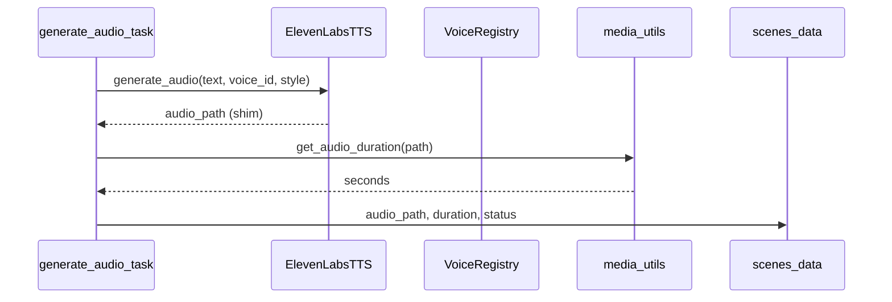

# Audio Pipeline

Documentación del pipeline de audio: TTS, duraciones y sincronización con vídeo.

---

## Arquitectura



---

## Proveedores TTS

### ElevenLabs (ruta principal en tareas)

**Archivo:** `services/tts/elevenlabs_tts.py`

Estado actual en código: **shim de desarrollo**, no llama a la API real.

```python
async def generate_audio(self, text, voice_id, style="neutral") -> str:
    await asyncio.sleep(0)
    return f"generated_audio/{voice_id}_{abs(hash(text)) % 100000}.mp3"
```

Configuración prevista (`core/config.py`):

| Variable | Default |
|----------|---------|
| ELEVENLABS_API_KEY | None |
| ELEVENLABS_MODEL | eleven_multilingual_v2 |
| ELEVENLABS_TIMEOUT | 30.0 |

### gTTS

En `requirements.txt` (`gTTS==2.5.1`). Usado por `tts_service.py` como fallback en `assemble_video` cuando no hay `audio_path` en escena.

### Fallback TTS

`services/tts/fallback_tts.py` — cadena alternativa si ElevenLabs falla (revisar implementación al integrar producción).

### Caché de audio

`services/tts/audio_cache.py` — evita regenerar mismos textos/voces.

---

## Voice selection

**`VoiceRegistry`** (`tts/voice_registry.py`):

- Mapea `character` de escena (default `"narrator"`) → `voice_id` ElevenLabs
- Invocado en `audio_generation.generate_audio_task`:

```python
character = scene.get("character", "narrator")
voice_data = registry.get_voice(character)
voice_id = voice_data["voice_id"]
style = scene.get("emotion", "neutral")
```

---

## Generación por escena (Celery)

**Tarea:** `app.tasks.audio_generation.generate_audio_task`

| Paso | Detalle |
|------|---------|
| Idempotencia | Si `scene_progress[idx].audio == "done"` → skip |
| Texto | `voiceover_text` → `text` → `narration` → fallback `"Scene N"` |
| Estado pipeline | `AUDIO_GENERATION`, progress ~55 |
| Job tracking | `VideoJobService` create/mark |
| Post | `scene["duration"]` desde ffprobe |
| Status escena | `AUDIO_GENERATED` |

**Callback:** `audio_complete_callback` — log únicamente.

Orden en pipeline: **después de todas las imágenes**, antes de director quality y composición.

---

## Cálculo de duración

### `media_utils.get_audio_duration`

Usado por tarea de audio tras generar MP3.

### `VideoGenerator._get_audio_duration`

```bash
ffprobe -v error -show_entries format=duration -of default=noprint_wrappers=1:nokey=1 <file>
```

Fallback: **5.0 s** si ffprobe falla.

### Uso en vídeo

`_create_scene_clip`: `duration = max(audio_duration, 3.0)`  
Zoompan: `d = int(duration * 25)` frames aprox.

---

## Normalización de audio

En clip FFmpeg:

- Codec AAC 192 kbps
- Stream mapeado desde archivo TTS
- No hay loudnorm explícito en filtro principal auditado; posible en módulos `services/audio/`

---

## Sincronización audiovisual

| Mecanismo | Descripción |
|-----------|-------------|
| Audio-first duration | Duración clip = duración audio |
| Timeline engine | `merge_media_state` pone duration al asignar audio |
| validate_timeline | Bloquea render sin duration > 0 |
| Mínimo 3 s | Evita clips flash |

La duración del campo `duration` en guion LLM (entero segundos) es **orientativa**; prevalece la duración medida del audio generado.

---

## Integración producción ElevenLabs

Pasos para implementación real (no en repo):

1. Instalar SDK oficial o REST `https://api.elevenlabs.io/v1/text-to-speech/{voice_id}`
2. Header `xi-api-key: ELEVENLABS_API_KEY`
3. Guardar bytes MP3 vía `storage.save`
4. Mantener contrato `generate_audio` → path relativo
5. Probar `get_audio_duration` con archivo real

---

## Variables de entorno audio

| Variable | Obligatoria | Descripción |
|----------|-------------|-------------|
| ELEVENLABS_API_KEY | Para prod real | API key |
| ELEVENLABS_MODEL | No | Modelo voz |
| ELEVENLABS_TIMEOUT | No | Timeout HTTP |

---

## Riesgos

| ID | Riesgo | Clasificación |
|----|--------|---------------|
| A1 | Shim devuelve path sin archivo | Alta — ffprobe fallará o fallback 5s |
| A2 | Múltiples proveedores sin cadena unificada | Media |
| A3 | Sin normalización LUFS | Baja — calidad plataforma |
