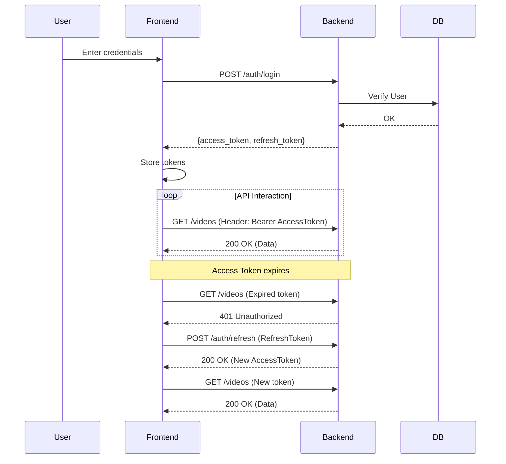

# Authentication System

## Overview

The platform uses a stateless JWT (JSON Web Token) authentication system. This allows the backend to be horizontally scalable while maintaining secure user sessions.

## Token Types

- **Access Token**: Short-lived (duration: 30 minutes). Used in the `Authorization: Bearer <token>` header for every API request.
- **Refresh Token**: Long-lived (duration: 7 days). Used only to obtain a new Access Token. It is stored securely on the client.

## Authentication Flow

### 1. Login/Registration

1.  User sends credentials (`email`, `password`) to `/auth/login` or `/auth/register`.
2.  Backend verifies credentials and generates a token pair (Access + Refresh).
3.  Frontend stores both tokens in `localStorage` (Note: In future phases, tokens will be moved to HttpOnly cookies for enhanced security).

### 2. Authenticated Requests

1.  The Angular `AuthInterceptor` retrieves the Access Token from storage.
2.  It adds the header `Authorization: Bearer <access_token>` to every outgoing request.
3.  Backend uses the `get_current_user` dependency to validate the token and extract the `user_id`.

### 3. Token Expiration & Refresh

1.  If a request fails with `401 Unauthorized` (due to an expired Access Token):
    - The `AuthInterceptor` catches the error.
    - It sends a POST request to `/auth/refresh` containing the stored Refresh Token.
    - If valid, the backend returns a new Access Token.
    - The interceptor retries the original failed request with the new token.
2.  If the Refresh Token is also expired, the user is automatically logged out.

## Lifecycle Diagram

## Route Protection

- **Backend**: Uses FastAPI dependencies. Routes without the dependency are public.
- **Frontend**: Uses the `AuthGuard`. Any attempt to access protected routes (like `/dashboard`) without a valid session redirects the user to `/login`.
