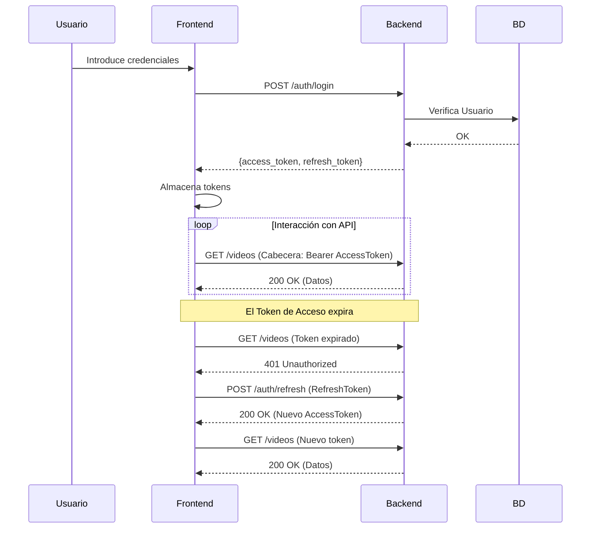

# Sistema de Autenticación

## Descripción General

La plataforma utiliza un sistema de autenticación sin estado JWT (JSON Web Token). Esto permite que el backend sea escalable horizontalmente mientras mantiene seguras las sesiones de usuario.

## Tipos de Token

- **Token de Acceso (Access Token)**: De corta duración (duración: 30 minutos). Se utiliza en la cabecera `Authorization: Bearer <token>` para cada petición a la API.
- **Token de Actualización (Refresh Token)**: De larga duración (duración: 7 días). Se utiliza únicamente para obtener un nuevo Token de Acceso. Se almacena de forma segura en el cliente.

## Flujo de Autenticación

### 1. Inicio de Sesión/Registro

1.  El usuario envía sus credenciales (`email`, `password`) a `/auth/login` o `/auth/register`.
2.  El backend verifica las credenciales y genera un par de tokens (Acceso + Actualización).
3.  El frontend almacena ambos tokens en el `localStorage` (Nota: En fases futuras, los tokens se trasladarán a cookies HttpOnly para mayor seguridad).

### 2. Peticiones Autenticadas

1.  El `AuthInterceptor` de Angular recupera el Token de Acceso del almacenamiento.
2.  Añade la cabecera `Authorization: Bearer <access_token>` a cada petición saliente.
3.  El backend utiliza la dependencia `get_current_user` para validar el token y extraer el `user_id`.

### 3. Expiración y Actualización de Tokens

1.  Si una petición falla con `401 Unauthorized` (debido a un Token de Acceso caducado):
    - El `AuthInterceptor` captura el error.
    - Envía una petición POST a `/auth/refresh` que contiene el Token de Actualización almacenado.
    - Si es válido, el backend devuelve un nuevo Token de Acceso.
    - El interceptor reintenta la petición original fallida con el nuevo token.
2.  Si el Token de Actualización también ha caducado, se cierra automáticamente la sesión del usuario.

## Diagrama del Ciclo de Vida

## Protección de Rutas

- **Backend**: Utiliza dependencias de FastAPI. Las rutas sin la dependencia son públicas.
- **Frontend**: Utiliza el `AuthGuard`. Cualquier intento de acceder a rutas protegidas (como `/dashboard`) sin una sesión válida redirige al usuario a `/login`.
