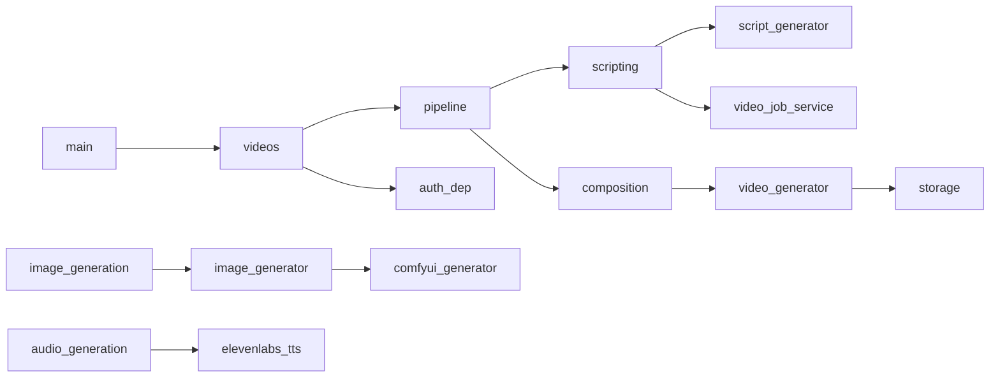

# Code Reference

Referencia de módulos del producto (excluye `venv`, `node_modules`). Estilo SDK: archivo → exports → dependencias → flujo.

---

## Entry points

### `backend/app/main.py`

| | |
|--|--|
| **Exports** | `app` (FastAPI) |
| **Clases** | — |
| **Funciones** | `on_startup`, `on_shutdown`, `root`, `list_ai_backends` |
| **Dependencias** | routers v1, `init_db`, `recover_videos_on_startup`, scheduler, ComfyUI httpx |
| **Flujo** | Startup DB → recovery → scheduler → ComfyUI task; mount `/media` |

### `frontend/auto-video-frontend/src/main.ts`

Bootstrap Angular standalone.

### `frontend/auto-video-frontend/main.js`

Electron main process → carga ventana browser.

---

## Core (`backend/app/core/`)

| Archivo | Clases / objetos | Funciones clave | Dependencias |
|---------|------------------|-----------------|--------------|
| `config.py` | `Settings`, `settings` | `env_bool`, `use_comfyui` | pydantic-settings, dotenv |
| `database.py` | engines | `init_db`, `get_async_session`, `get_sync_session` | SQLModel, asyncpg, psycopg2 |
| `celery_app.py` | `celery_app` | heartbeat Redis | celery, redis |
| `llm_client.py` | `LocalLLMClient`, `llm_client` | `generate`, `chat` | httpx, settings |
| `gemini_client.py` | — | `generate_gemini_prompt` | google.generativeai |
| `security.py` | — | `hash_password`, `create_access_token`, `create_refresh_token` | passlib/jwt |
| `limiter.py` | `limiter` | — | slowapi |
| `scheduler.py` | — | `start_scheduler`, `stop_scheduler` | APScheduler |
| `cache.py` | — | Redis client | redis |
| `encryption.py` | — | encrypt/decrypt tokens | cryptography, ENCRYPTION_KEY |
| `Model_Registry.py` | registro modelos ML | — | torch/diffusers |

---

## API (`backend/app/api/v1/`)

| Módulo | Router prefix interno | Montaje main |
|--------|----------------------|--------------|
| `auth.py` | — | `/api/v1/auth` |
| `videos.py` | — | `/api/v1/videos` |
| `ai.py` | — | `/api/v1/ai` |
| `system.py` | `/system` | `/api/v1` → `/api/v1/system/*` |
| `orchestration.py` | — | `/api/v1/orchestration` |
| `director.py` | `/director` | **no** |
| `network.py` | `/network` | **no** |
| `economy.py` | `/economy` | **no** |
| `images.py` | `/images` | **no** |

---

## Tasks (`backend/app/tasks/`)

### `pipeline.py`

```text
process_video_workflow(video_id_str)
  → scripting_task.run
  → validate_task.run
  → director_precheck_task.run
  → build_dynamic_pipeline.run

build_dynamic_pipeline(video_id_str)
  → loop generate_image_task.run(i)
  → images_complete_callback.run
  → loop generate_audio_task.run(i)
  → audio_complete_callback.run
  → director_quality_analysis_task.run
  → director_pacing_optimization_task.run
  → compose_video_task.run
  → director_final_analysis_task.run
  → encode_video_task.run
  → upload_task.run
```

### `scripting.py`

- `scripting_task` — Celery bind, max_retries 3
- `validate_task` — validación post-guion

### `image_generation.py`

- `generate_image_task(video_id, scene_idx)` — gpu_queue, GPU lock
- `images_complete_callback`

### `audio_generation.py`

- `generate_audio_task`, `audio_complete_callback`

### `composition.py`

- `compose_video_task` → `VideoGenerator.assemble_video`

### `encoding.py` / `upload.py`

Placeholders fin de pipeline.

### `director_tasks.py`

Stubs logging.

### `gpu_lock.py`

- `acquire_gpu_lock` context manager
- `GPULockError`

### `utils.py`

- `update_video_status(session, video, state, progress=..., error_*)`

### `task_helpers.py`

- `raise_or_retry(task, exc, countdown)`

---

## Models (`backend/app/models/`)

| Archivo | Tabla(s) |
|---------|----------|
| `user.py` | user |
| `template.py` | template |
| `generated_video.py` | video + PipelineState |
| `video_job.py` | videojob |
| `asset.py` | asset |
| `channel.py` | channel |
| `user_settings.py` | user_settings |
| `viral_intelligence.py` | trending_topic, viral_analysis, ... |
| `orchestration.py` | content_schedule, campaign, agent_memory_record |
| `director.py` | scene_quality_report, ... |
| `media_network.py` | channel_profile, narrative_universe, ... |
| `channel_config.py` | schedule rules (conflicto nombre ChannelProfile) |

---

## Schemas (`backend/app/schemas/`)

| Archivo | Modelos |
|---------|---------|
| `generated_video_schema.py` | Create, Read, Status, Page, Update |
| `ai_schema.py` | AIScript*, AITextEnhance* |
| `auth_schema.py` | UserCreate, UserRead, Token, UserLogin |
| (+ en routers) | viral, clips, templates |

---

## Utils (`backend/app/utils/`)

| Archivo | Funciones |
|---------|-----------|
| `uuid_utils.py` | `generate_uuid7` |
| `progress_utils.py` | helpers progreso |
| `media_utils.py` | `get_audio_duration` |

---

## Dependencies (`backend/app/dependencies/`)

| Archivo | Funciones |
|---------|-----------|
| `auth.py` | `get_current_user` — decodifica JWT, carga User |

---

## Frontend services (`frontend/.../services/`)

| Archivo | Rol |
|---------|-----|
| `auth.service.ts` | login, register, token storage |
| `video.service.ts` | CRUD videos, generate, status poll, download |
| `ai.service.ts` | generate-script, enhance-text |
| `system.service.ts` | health, gpu, comfyui |
| `template.service.ts` | templates |
| `channel.service.ts` | channels |
| `settings.service.ts` | user settings |
| `style.service.ts` | styles API |

### `auth.interceptor.ts`

Añade `Authorization: Bearer` a requests HTTP.

### `auth.guard.ts`

Redirige a login si no autenticado.

---

## Frontend routes (`app.routes.ts`)

| Path | Componente |
|------|------------|
| `/login` | LoginComponent |
| `/register` | RegisterComponent |
| `/dashboard` | DashboardComponent |
| `/videos` | VideoListComponent lazy |
| `/videos/new` | VideoCreateComponent lazy |
| `/channels` | ChannelListComponent lazy |
| `/templates` | TemplateListComponent lazy |
| `/settings` | SettingsComponent lazy |

---

## Scripts operativos (`backend/scripts/`)

| Script | Uso |
|--------|-----|
| `check_comfyui.py` | Diagnóstico ComfyUI |
| `debug_comfyui.py` | Debug workflow |
| `run_pipeline_eager.py` | `process_video_workflow.run` sync |
| `trigger_test_job.py` | Encola job prueba |
| `clear_pipeline_queue.py` | Limpia cola / requeue |
| `monitor_video_live.py` | Monitor progreso |
| `poll_video_progress.py` | Polling CLI |
| `check_video_status.py` | Estado vídeo |
| `run_scripting_sync.py` | Scripting sin Celery |

### Raíz backend

| Archivo | Uso |
|---------|-----|
| `enqueue.py` | Encola todos los vídeos QUEUED |
| `reset.py` | Reset estados |
| `run_pipeline_test.py` | Test integración |

---

## Tests (`backend/app/tests/`)

| Archivo | Cobertura |
|---------|-----------|
| `test_script_generator.py` | ScriptGenerator |
| `test_async_api.py` | videos API (mock Celery) |
| `test_video_assembly.py` | VideoGenerator |
| `test_image_generation.py` | Imágenes |
| `test_ai_text_enhance.py` | enhance-text |
| `test_crash_recovery.py` | pipeline recovery |

---

## Flujo de dependencias (diagrama)



---

## Extension points

1. **Nuevo generador imagen:** subclase `BaseImageGenerator`, registrar en `ImageGenerator.__init__` según `USE_COMFYUI`.
2. **Nuevo paso Celery:** módulo en `tasks/`, ruta en `celery_app.conf.task_routes`, llamada en `build_dynamic_pipeline`.
3. **Nuevo endpoint:** `api/v1/*.py` + `include_router` en `main.py`.
4. **Frontend:** service + component + route.

---

## Archivos de configuración

| Archivo | Propósito |
|---------|-----------|
| `docker-compose.yml` | Postgres + Redis |
| `backend/.env` | Secrets locales |
| `backend/requirements.txt` | Deps Python |
| `frontend/.../package.json` | Deps Node |
| `frontend/.../angular.json` | Build Angular |
| `.vscode/settings.json` | IDE |

---

## Notas de consistencia código

| Tema | Detalle |
|------|---------|
| API version | 8.0.0 OpenAPI vs 4.0.0 en GET / |
| Generate path | `process_video_workflow.delay` vía API |
| Tests videos | Mock de `process_video_workflow` en tests async |
| Channel ID | UUID en schema create vs int en modelo legacy |
| ElevenLabs | Shim sin archivo real |
| sse-starlette | orchestration event-stream sin dep en requirements |
