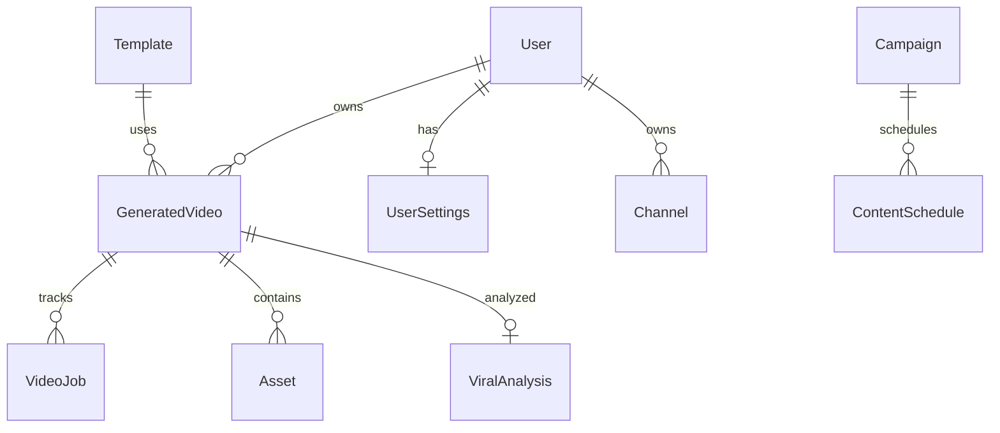

# Data Models

Modelos de persistencia (SQLModel), schemas API (Pydantic) y estructuras JSON en runtime.

---

## ORM — SQLModel

Motor: PostgreSQL. PKs: **UUID v7** (`generate_uuid7`) salvo `Channel.id` int.

`init_db()` crea tablas importadas en `core/database.py` — **no** incluye todos los modelos de `director.py`, `orchestration.py`, `media_network.py` (requieren migración Alembic manual o ampliar imports).

---

## Entidades principales

### User (`user`)

| Campo | Tipo | Validación / notas |
|-------|------|-------------------|
| id | UUID | PK |
| email | string | unique, index |
| password_hash | string | bcrypt vía security |
| plan | string | FREE default |
| minutes_used | int | 0 |
| created_at, updated_at | datetime | UTC |

### Template (`template`)

| Campo | Tipo | Notas |
|-------|------|-------|
| id | UUID | PK |
| name | string | |
| platform | string | ENUM app-level |
| style_config | JSONB | dict checkpoints, estilo |
| is_active | bool | |
| structure_json | string optional | JSON string para LLM |
| description | legacy | |

### GeneratedVideo (`video`)

| Campo | Tipo | Notas |
|-------|------|-------|
| id | UUID | PK |
| user_id | UUID FK user | nullable Phase 2 |
| template_id | UUID FK | |
| title | string | |
| platform | string | TIKTOK, REELS, SHORTS |
| status | string | videostatus enum |
| pipeline_state | PipelineState enum | |
| storage_key | string optional | path lógico storage |
| duration_seconds | float optional | |
| error_message | text | |
| error_step | string | |
| progress | int | 0–100 |
| retry_count | int | recovery |
| is_deleted | bool | soft delete |
| deleted_at | datetime | |
| scenes_data | JSONB | lista escenas pipeline |
| scene_progress | JSONB | `{"0":{"image":"done"}}` |
| channel_id | int optional | legacy |
| topic | string optional | input guion |

**PipelineState enum:** QUEUED, SCRIPTING, VALIDATED, IMAGE_GENERATION, AUDIO_GENERATION, MEDIA_COMPOSITION, ENCODING, UPLOADING, DONE, FAILED

### VideoJob (`videojob`)

| Campo | Tipo |
|-------|------|
| id | UUID |
| video_id | UUID FK |
| step | string |
| started_at, ended_at | datetime |
| success | bool |
| error_message | string |

### Asset (`asset`)

| Campo | Tipo |
|-------|------|
| id | UUID |
| video_id | UUID |
| type | string |
| storage_key | string |
| duration_seconds | float |

### Channel (`channel`)

| Campo | Tipo |
|-------|------|
| id | int PK | 
| user_id | UUID |
| name, platform | string |
| OAuth tokens | campos en modelo |
| channel_id | string plataforma |
| is_active | bool |

### UserSettings (`user_settings`)

| Campo | Tipo |
|-------|------|
| id | UUID |
| user_id | UUID unique |
| gemini_api_key | optional |
| preferred_gemini_model | optional |
| extra_config | JSONB |

---

## Viral Intelligence (`viral_intelligence.py`)

### TrendingTopic (`trending_topic`)

topic, category, virality/momentum scores, hook_patterns, visual_style, timestamps.

### ViralAnalysis (`viral_analysis`)

video_id optional, script_text, hook/retention/pacing scores, overall_score, recommendations.

### ContentEmbedding (`content_embedding`)

entity_id, entity_type, vector_data, extra_metadata.

### ClipAnalysis (`clip_analysis`)

source_video_path, clip_path, time range, highlight_score, transcript.

### VideoPerformanceMetrics (`video_performance_metrics`)

video_id, views/likes/shares, retention_data, ctr, platform.

### ViralPattern, HookTemplate, StylePerformance

Patrones y plantillas de hooks con scores y usage_count.

---

## Orchestration (`orchestration.py`)

### ContentSchedule (`content_schedule`)

platform, publish_time, trend_topic, status, predicted_score.

### Campaign (`campaign`)

name, total_episodes, current_episode, storyline JSONB.

### AgentMemoryRecord (`agent_memory_record`)

agent_name, state, recent_decisions, recent_errors.

---

## Director (`director.py`)

| Modelo | Tabla | Campos clave |
|--------|-------|--------------|
| SceneQualityReport | scene_quality_report | job_id, scene_id, quality_score, metrics JSONB |
| NarrativeAnalysis | narrative_analysis | narrative_score, retention_prediction |
| RegenerationAttempt | regeneration_attempt | prompt_mutations, success |
| VariantBattle | variant_battle | variants, winner_id |
| VisualConsistencyReport | visual_consistency_report | continuity_score |
| CinematicPattern | cinematic_pattern | pattern_signature |

---

## Media Network (`media_network.py`)

ChannelProfile, BrandIdentity, NarrativeUniverse, CharacterProfile, PublishingStrategy — perfiles de red de contenido con JSONB lore/storylines.

**Conflicto de nombres:** `channel_config.ChannelProfile` duplica nombre con distinto schema (int PK vs UUID network).

---

## Pydantic Schemas (API)

### `generated_video_schema.py`

- `GeneratedVideoCreate` — template_id, title, platform, topic?, channel_id?, style_config?
- `GeneratedVideoUpdate` — status?, storage_key?
- `GeneratedVideoRead` — respuesta completa
- `GeneratedVideoStatus` — polling
- `GeneratedVideoPage` — paginación

### `ai_schema.py`

- `AIScriptRequest` — topic, template_id Union[UUID,int], tone, audience, language, platform
- `AIScene` — text, duration, image_prompt?
- `AIScriptResponse` — scenes[]
- `AITextEnhanceRequest/Response`

### `auth_schema.py`

UserCreate, UserRead, Token, UserLogin.

### Viral / clips / analytics

Schemas en mismos módulos API (`viral.py`, `clips.py`, `analytics.py`) — response models `ViralScoreResponse`, `ClipAnalysisResponse`, `MetricsResponse`, etc.

---

## JSON runtime — escena canónica

Tras scripting + media:

```json
{
  "text": "string",
  "duration": 12.5,
  "image_prompt": "english prompt",
  "image_path": "generated_images/....png",
  "audio_path": "generated_audio/....mp3",
  "status": "READY",
  "character": "narrator",
  "emotion": "neutral",
  "camera_motion": "dynamic"
}
```

---

## Relaciones lógicas



---

## Uso en sistema

| Modelo | Lectores principales |
|--------|---------------------|
| GeneratedVideo | videos API, todas las tasks |
| VideoJob | VideoJobService |
| Template | scripting, ai generate-script |
| TrendingTopic | scripting viral injection, trends API |
| UserSettings | scripting API keys |
