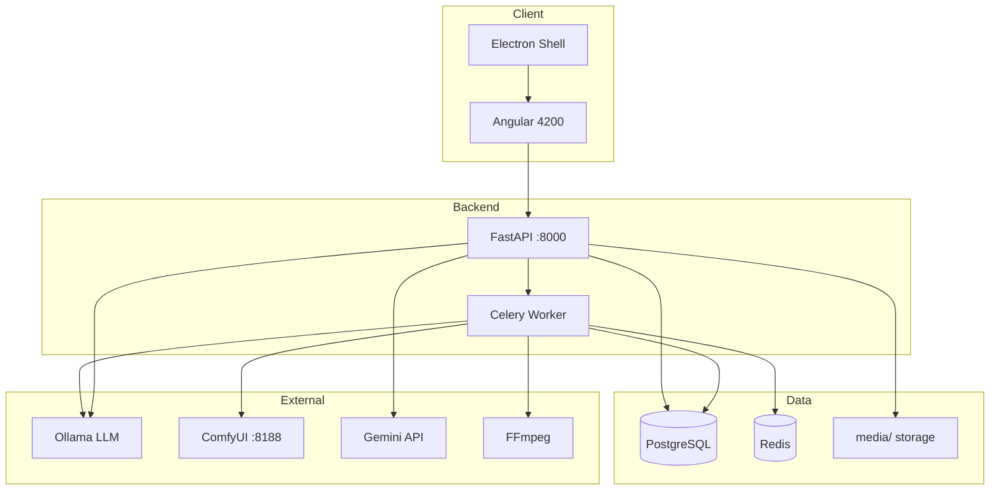

# Auto Video Maker — Documentación Técnica Empresarial

**Versión del producto (API):** 8.0.0 (`backend/app/main.py`)  
**Nombre del proyecto:** Auto Video Maker / Auto Video Maker API  
**Última auditoría de código:** 2026-06-02  
**Alcance:** Documentación derivada exclusivamente del repositorio `APP/` (código fuente, configuración, scripts). No incluye `backend/venv/`, `node_modules/`, ni cachés de build.

---

## Índice de documentación

| Documento | Contenido |
|-----------|-----------|
| [ARCHITECTURE.md](./ARCHITECTURE.md) | Arquitectura global, despliegue, flujos E2E, Celery, Redis, escalabilidad, mantenimiento |
| [API.md](./API.md) | Referencia completa de endpoints HTTP |
| [AI_PIPELINE.md](./AI_PIPELINE.md) | LLMs, guiones, ComfyUI, SDXL, planificación de escenas |
| [VIDEO_PIPELINE.md](./VIDEO_PIPELINE.md) | FFmpeg, motion, transiciones, ensamblado |
| [AUDIO_PIPELINE.md](./AUDIO_PIPELINE.md) | TTS, ElevenLabs, duraciones, sincronización |
| [DEPLOYMENT.md](./DEPLOYMENT.md) | Desarrollo, producción, Docker, GPU, Windows/Linux |
| [SECURITY.md](./SECURITY.md) | Análisis de riesgos y hardening |
| [DATA_MODELS.md](./DATA_MODELS.md) | SQLModel, schemas Pydantic, relaciones |
| [SERVICES.md](./SERVICES.md) | Catálogo de servicios del backend |
| [CODE_REFERENCE.md](./CODE_REFERENCE.md) | Referencia por módulo (estilo SDK) |

**Regla de prioridad:** ante conflicto entre comentarios y código, prevalece el código.

---

## Qué hace el sistema

Auto Video Maker es una plataforma SaaS multi-usuario para **generación automatizada de vídeos cortos** orientados a redes sociales (TikTok, YouTube Shorts, Instagram Reels). El sistema:

1. Autentica usuarios (JWT).
2. Gestiona canales, plantillas y proyectos de vídeo (`GeneratedVideo`).
3. Genera guiones con LLM local (Ollama) y fallback a Google Gemini.
4. Opcionalmente enriquece temas con motores de “Viral Intelligence” y aprendizaje autónomo.
5. Genera imágenes por escena vía **ComfyUI** (Stable Diffusion XL / checkpoint configurable).
6. Genera audio por escena (shim ElevenLabs en el código actual de tareas).
7. Compone el vídeo final con **FFmpeg** (Ken Burns, overlays de texto, concatenación).
8. Encola el pipeline de generación en **Celery** y expone progreso vía API y frontend Angular + shell Electron.

---

## Repository Inventory

### Raíz del repositorio (`APP/`)

| Ruta | Tipo | Propósito |
|------|------|-----------|
| `start_app.ps1` | Script PowerShell | Arranca backend (`run_backend.ps1`), worker Celery (`--pool=solo`), `ng serve`, y Electron tras 15 s |
| `start_services.ps1` | Script | Variante de arranque de servicios (infra + componentes) |
| `docker-compose.yml` | Infra | PostgreSQL 15 y Redis 7 (no incluye backend/frontend en contenedor) |
| `docs/` | Documentación | Este paquete + guías legacy |
| `backend/` | API + workers | FastAPI, Celery, ~320 módulos Python en `app/` |
| `frontend/auto-video-frontend/` | Cliente | Angular 20 + Electron 39 |
| `.vscode/settings.json` | IDE | Configuración del workspace |
### `backend/`

| Ruta | Propósito |
|------|-----------|
| `app/main.py` | Entry point FastAPI, CORS, rate limit, routers, static `/media`, startup ComfyUI y recovery |
| `app/api/v1/` | 18 módulos de routers REST |
| `app/core/` | Config, DB, Celery, JWT, LLM/Gemini, scheduler, limiter, cache Redis |
| `app/models/` | SQLModel (13 archivos de dominio) |
| `app/schemas/` | Pydantic request/response |
| `app/tasks/` | Tareas Celery del pipeline de vídeo |
| `app/services/` | ~246 archivos: IA, viral, orquestación, render, TTS, storage, economía, universo narrativo, etc. |
| `app/utils/` | UUID, progreso, media |
| `app/tests/` | pytest (scripting, API async, assembly, imágenes, AI) |
| `app/dependencies/` | Auth FastAPI |
| `requirements.txt` | Dependencias Python pinneadas + ML sin pin |
| `run_backend.ps1` | `uvicorn app.main:app [--reload]` |
| `run_celery.ps1` | Worker Celery |
| `alembic/` | Migraciones DB (si presente) |
| `.env` | Variables locales (**no commitear secretos**) |
| `media/` | Archivos estáticos servidos por FastAPI |
| `scripts/` | Operaciones: ComfyUI check, pipeline eager, monitor, cola |
| `enqueue.py`, `reset.py` | Utilidades de cola/reset |
| `TESTING_GUIDE.md` | Guía de pruebas backend |

### `backend/app/api/v1/` (routers)

| Archivo | Montado en `main.py` | Prefijo efectivo |
|---------|---------------------|------------------|
| `auth.py` | Sí | `/api/v1/auth` |
| `channels.py` | Sí | `/api/v1/channels` |
| `templates.py` | Sí | `/api/v1/templates` |
| `videos.py` | Sí | `/api/v1/videos` |
| `ai.py` | Sí | `/api/v1/ai` |
| `settings.py` | Sí | `/api/v1/settings` |
| `trends.py` | Sí | `/api/v1/trends` |
| `viral.py` | Sí | `/api/v1/viral-score` |
| `clips.py` | Sí | `/api/v1/clips` |
| `analytics.py` | Sí | `/api/v1/analytics` |
| `styles.py` | Sí | `/api/v1/styles` |
| `learning.py` | Sí | `/api/v1/learning` |
| `system.py` | Sí | `/api/v1/system` |
| `orchestration.py` | Sí | `/api/v1/orchestration` |
| `director.py` | **No** | (definido `/director`) |
| `economy.py` | **No** | (definido `/economy`) |
| `images.py` | **No** | (definido `/images`) |
| `network.py` | **No** | (definido `/network`) |

### `backend/app/tasks/`

| Archivo | Responsabilidad |
|---------|-----------------|
| `pipeline.py` | Orquestación Celery: scripting → validate → director precheck → build_dynamic_pipeline |
| `scripting.py` | Guion + escenas en JSONB |
| `image_generation.py` | ComfyUI por escena + GPU lock Redis |
| `audio_generation.py` | TTS por escena |
| `composition.py` | `VideoGenerator.assemble_video` |
| `encoding.py` | Paso de encoding (placeholder) |
| `upload.py` | Marca DONE (placeholder upload) |
| `director_tasks.py` | Stubs de análisis de director |
| `gpu_lock.py` | Lock distribuido Redis para GPU |
| `utils.py`, `task_helpers.py` | Estado de vídeo y reintentos |

### `backend/app/services/` (dominios principales)

Árbol lógico (subcarpetas con propósito):

```
services/
├── ai/                    # Generación de imagen (ComfyUI, SDXL, caché, prompts)
├── ai_director/           # Decisiones creativas, supervisor de escenas
├── adaptive_editing/      # Timeline adaptativo
├── analytics/             # Métricas de rendimiento
├── audience_ai/           # Audiencia
├── audio/                 # Procesamiento de audio
├── autonomous_learning/   # Hooks, A/B, saturación de trends, memoria viral
├── brand_ai/              # Identidad de marca
├── captions/              # Subtítulos
├── channel_network/       # Red de canales, diversidad, patrones
├── cinematic_memory/      # Memoria cinematográfica
├── clips/                 # Análisis de clips
├── consistency/           # Continuidad visual entre escenas
├── content_lifecycle/     # Ciclo de vida del contenido
├── creative_feedback/     # Feedback creativo
├── distributed/           # Ejecución distribuida
├── distributed_cache/     # Caché distribuida
├── economy/               # GPI, asignación de recursos (API no montada)
├── embeddings/            # Vectores de contenido
├── health/                # Salud pipeline/Celery
├── hooks/                 # Hooks virales
├── idea_engine/           # Generación de ideas desde trends
├── isolation/             # Aislamiento multi-tenant
├── logging/               # Logging estructurado
├── monitoring/            # GPU watchdog
├── narrative_ai/          # Narrativa
├── observability/         # Métricas
├── orchestration/         # Master orchestrator, agentes, event bus
├── pacing_ai/             # Ritmo
├── platform_ai/           # Por plataforma
├── prediction_ai/         # Predicción
├── publishing_ai/         # Publicación
├── quality_ai/            # Calidad de escena
├── recovery/              # Recuperación
├── recovery_distributed/  # Recuperación distribuida
├── render/                # Pipeline de render
├── revenue_ai/            # Revenue
├── scheduler/             # Planificación de contenido
├── storage/               # Local / S3
├── story/                 # Optimización de escenas
├── styles/                # Estilos visuales
├── telemetry/             # Telemetría
├── tenancy/               # Multi-tenancy
├── timeline/              # SceneTimelineEngine (estructura canónica de escena)
├── trends/ + trends_engine/  # Tendencias
├── tts/                   # ElevenLabs shim, registry, fallback, caché
├── universe_engine/       # Universos narrativos, lore, personajes
├── variants/              # Variantes A/B de vídeo
├── video_ai/              # SVD, AnimateDiff, hybrid, providers futuros
├── viral/ + viral_core/   # Puntuación viral, hooks
└── visual_fx/             # Transiciones FFmpeg
```

Archivos sueltos en raíz de `services/` relevantes para el pipeline core:

- `script_generator.py` — Guiones LLM
- `image_generator.py` — Wrapper ComfyUI síncrono
- `video_generator.py` — Ensamblado FFmpeg
- `video_recovery.py` — Requeue Celery al startup
- `video_job_service.py` — Jobs por paso
- `comfyui_health.py` — Health ComfyUI

### `frontend/auto-video-frontend/`

| Ruta | Propósito |
|------|-----------|
| `src/app/app.routes.ts` | Rutas Angular (dashboard, videos, channels, templates, settings) |
| `src/app/features/` | Componentes por feature |
| `src/app/services/` | Clientes HTTP (`video`, `auth`, `ai`, `system`, etc.) |
| `src/app/interceptors/auth.interceptor.ts` | Bearer JWT |
| `src/app/guards/auth.guard.ts` | Protección de rutas |
| `main.js` | Proceso principal Electron |
| `package.json` | Angular 20.3, Electron 39, Tailwind |

### Infraestructura externa (no en repo, requerida por código)

| Servicio | Puerto / URL por defecto | Uso |
|----------|--------------------------|-----|
| PostgreSQL | `localhost:5432` | Persistencia SQLModel |
| Redis | `localhost:6379` | Broker Celery, result backend, GPU lock, heartbeat worker |
| Ollama / LLM local | `http://192.168.1.41:11434` | Guiones (`LOCAL_LLM_URL`) |
| ComfyUI | `http://127.0.0.1:8188` | Imágenes SDXL |
| FFmpeg / ffprobe | PATH del SO | Composición y duraciones |
| ElevenLabs | API cloud | TTS (integración real pendiente; shim en repo) |
| Google Gemini | API | Fallback de guion |

### MCP

No se encontraron servidores MCP ni integraciones MCP en el código de aplicación del repositorio (búsqueda en `backend/app`, `frontend/`). Las dependencias de Cursor/skills del IDE están fuera del árbol de producto.

---

## Technology Stack (resumen)

Detalle ampliado en [ARCHITECTURE.md](./ARCHITECTURE.md#technology-stack).

| Capa | Tecnología | Versión (requirements / package.json) |
|------|------------|--------------------------------------|
| API | FastAPI | 0.121.2 |
| ASGI | Uvicorn | 0.38.0 |
| ORM | SQLModel / SQLAlchemy | 0.0.27 / 2.0.44 |
| DB | PostgreSQL 15 (Docker) | imagen `postgres:15-alpine` |
| Cola | Celery + Redis | 5.3.6 / 5.0.1 |
| Frontend | Angular | ^20.3.0 |
| Desktop | Electron | ^39.2.2 |
| IA texto | Ollama HTTP API + google-generativeai | modelo default `llama3.1:8b-instruct-q4_K_M` |
| IA imagen | ComfyUI + diffusers/torch (opcional SDXL local) | checkpoint `Juggernaut-XL_v9_...` |
| Vídeo | FFmpeg libx264, zoompan, vidstab | sistema |
| Auth | JWT HS256 | `python-jose` vía `core/security` |
| Rate limit | slowapi | usado en `main.py` (no listado en requirements.txt) |

---

## Arranque rápido (referencia)

Ver [DEPLOYMENT.md](./DEPLOYMENT.md) para pasos completos.

```powershell
# Infra
docker compose up -d

# Backend
cd backend
.\venv\Scripts\Activate.ps1
uvicorn app.main:app --reload

# Celery worker (obligatorio para generar vídeos)
celery -A app.core.celery_app worker --pool=solo -Q cpu_queue,gpu_queue,upload_queue -l info

# Frontend + Electron
cd ..\frontend\auto-video-frontend
npm start
npm run electron
```

O desde raíz: `.\start_app.ps1`

---

## Diagrama de contenedores (Mermaid)



---

## Mantenimiento de esta documentación

Al cambiar el pipeline Celery, routers no montados, o integración TTS real, actualizar: `README.md`, `ARCHITECTURE.md`, `API.md`, `VIDEO_PIPELINE.md`, `AUDIO_PIPELINE.md`.
