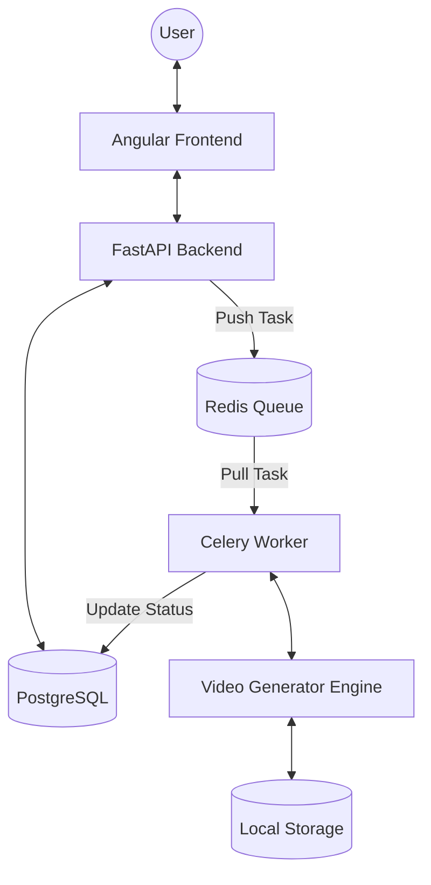

# System Architecture

## Overview

The Auto Video Maker is a distributed system designed to automate the process of video creation. It converts text scripts or templates into fully rendered videos using AI for images, voice synthesis, and FFmpeg for composition.

## Architecture Diagram

## Component Responsibilities

### Angular Frontend

- Provides the user interface for managing templates and videos.
- Handles user authentication and session management.
- Polls the backend for video generation status.
- Displays progress updates to the user.

### FastAPI Backend

- Acts as the central API gateway.
- Handles request validation, authentication (JWT), and authorization.
- Manages the database state (PostgreSQL).
- Orchestrates video generation by pushing jobs to the Redis queue.
- Serves video downloads and metadata.

### Celery Worker

- Processes long-running video generation tasks asynchronously.
- Manages the video pipeline execution (scripting, media generation, composition).
- Handles retries and error recovery.
- Updates the `VideoJob` status in the database at each step.

### PostgreSQL Database

- Stores persistent data: Users, Templates, GeneratedVideos, VideoJobs, and Assets.
- Maintains the state of the video generation pipeline.

### Redis Queue

- Acts as the message broker between the FastAPI backend and Celery workers.

### Video Generator Engine

- The core logic for creating media.
- Integrates with external APIs (AI image generators, TTS services).
- Uses FFmpeg for final video encoding and composition.

### Local Storage

- Stores intermediate assets (images, audio files) and the final rendered videos.
- Organized by user and video ID to ensure isolation.
