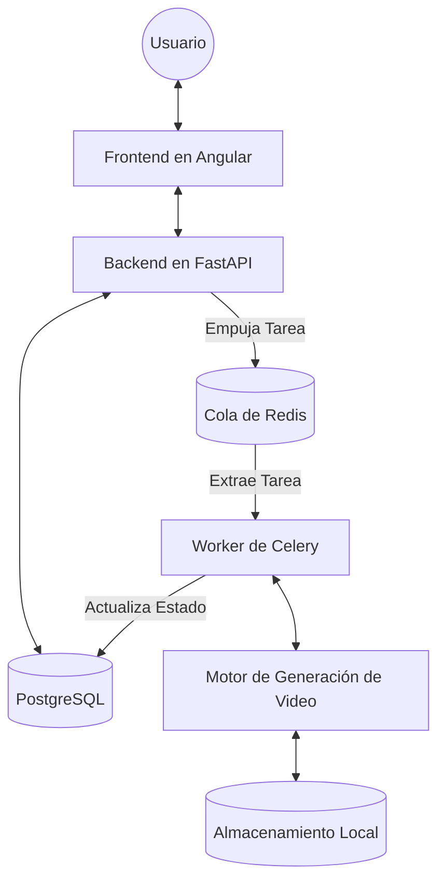

# Arquitectura del Sistema

## Descripción General

Auto Video Maker es un sistema distribuido diseñado para automatizar el proceso de creación de video. Convierte guiones de texto o plantillas en videos completamente renderizados utilizando IA para imágenes, síntesis de voz y FFmpeg para la composición.

## Diagrama de Arquitectura

## Responsabilidades de los Componentes

### Frontend en Angular

- Proporciona la interfaz de usuario para gestionar plantillas y videos.
- Gestiona la autenticación de usuarios y la sesión.
- Realiza sondeos (polls) al backend para conocer el estado de la generación del video.
- Muestra actualizaciones de progreso al usuario.

### Backend en FastAPI

- Actúa como la puerta de enlace central de la API.
- Gestiona la validación de peticiones, la autenticación (JWT) y la autorización.
- Gestiona el estado de la base de datos (PostgreSQL).
- Orquesta la generación de video enviando trabajos a la cola de Redis.
- Sirve las descargas de video y los metadatos.

### Worker de Celery

- Procesa asíncronamente las tareas de generación de video de larga duración.
- Gestiona la ejecución de la tubería de video (guionizado, generación de medios, composición).
- Gestiona los reintentos y la recuperación de errores.
- Actualiza el estado del `VideoJob` en la base de datos en cada paso.

### Base de Datos PostgreSQL

- Almacena datos persistentes: Usuarios (Users), Plantillas (Templates), Videos Generados (GeneratedVideos), Trabajos de Video (VideoJobs) y Activos (Assets).
- Mantiene el estado de la tubería de generación de video.

### Cola de Redis

- Actúa como intermediario de mensajes (message broker) entre el backend FastAPI y los workers de Celery.

### Motor de Generación de Video

- La lógica central para crear medios.
- Se integra con APIs externas (generadores de imágenes por IA, servicios de TTS).
- Utiliza FFmpeg para la codificación y composición final del video.

### Almacenamiento Local

- Almacena activos intermedios (imágenes, archivos de audio) y los videos renderizados finales.
- Organizado por usuario e ID de video para asegurar el aislamiento.
